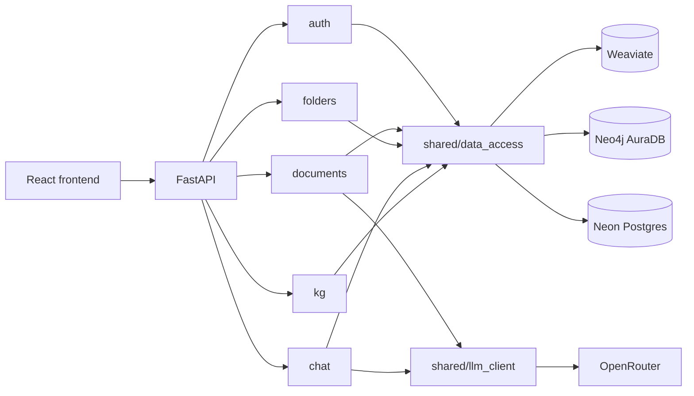

# GraphMind — Architecture Overview

A two-page orientation to the system and the decisions that shaped it. The
full, normative version — every invariant with its binding requirement and
its rationale — lives in the
[architecture spine](_bmad-output/planning-artifacts/architecture/architecture-GraphMind-Intelligent-Document-Assistant-2026-08-11/ARCHITECTURE-SPINE.md).
Where this file and the spine disagree, the spine wins.

## What the system is

A document question-answering service. A user uploads documents; the backend
parses them into passages, embeds those passages into a vector store, and
extracts entities and relationships into a per-user knowledge graph. Questions
are answered from retrieved passages only, each answer carrying citations back
to the passage it came from — and an explicit refusal when retrieval finds
nothing good enough.

## Shape: a feature-based modular monolith

One FastAPI application, split into vertical feature slices rather than
horizontal layers. Each module owns its own routing, business logic, and data
access:

```
backend/app/
  auth/       signup, login, JWT issuance, email verification, account deletion
  documents/  upload, parse, chunk, dedupe, ingest, list, delete
  folders/    grouping documents into folders
  chat/       question routing, retrieval, refusal short-circuit, answer generation
  kg/         read-only knowledge-graph queries for visualisation
  shared/
    data_access/   the only path to Weaviate, Neo4j, and Postgres
    llm_client/    the only path to OpenRouter
    email/         verification mail (Brevo HTTP API, or SMTP, or console)
    i18n/          server-side message catalogues (English / Bulgarian)
    models.py      SQLAlchemy ORM models
    rate_limiter.py
frontend/src/
  pages/      Chat, Documents, Graph, Settings
  components/ shared UI
  context/    auth/user, theme, chat document scope
  api/        typed backend client
  i18n/       client-side locale catalogues
```

The choice was deliberate: a layered structure (`routers/`, `services/`,
`repositories/`) would make every feature change touch several shared
directories, which for two developers on a 20-day timeline means constant
merge conflicts. Vertical slices let each contributor own a feature end to end.

Hexagonal / ports-and-adapters was considered and rejected. Its payoff is
swappable infrastructure behind stable interfaces; the stack here is fixed and
the project has a defined end date, so the indirection would have cost build
time without buying usable flexibility.

## Data flow



`kg` never touches the LLM wrapper — graph visualisation is a pure Cypher read.

**Ingestion.** Upload writes a Postgres row and returns immediately; a
background task carries the document through
`Uploaded → Extracting → Graphing → Ready | Failed`. Passages go to Weaviate
first, then entities to Neo4j. Weaviate computes the embeddings itself
(`text2vec-weaviate`) — the app runs no embedding model.

**Answering.** Each question is first classified by a small routing model into
a greeting, a whole-document overview request, or a specific factual question,
and is answered accordingly. Factual questions go through retrieval; the
relevance score is checked *before* any generation call, and a score below the
threshold returns the refusal directly.

## Key decisions

**Tenancy is enforced structurally, not by convention.** Every read and write
against Weaviate, Neo4j, and Postgres goes through `shared/data_access/`, which
takes `user_id` as a mandatory parameter. No feature module hand-writes a raw
query. `user_id` itself is always resolved server-side from the JWT, never
taken from the client. This was the one launch-blocking requirement, and
guarding it with a code-review convention across two parallel developers was
not good enough. `scripts/isolation_proof.py` drives the real API with two real
accounts to prove it holds.

**Failed ingestion rolls back rather than leaving orphans.** Write order is
fixed (Weaviate, then Neo4j) precisely so the rollback direction is
unambiguous: if the Neo4j write fails, the Weaviate objects just written are
deleted before the document is marked `Failed` with a readable reason. The
document's status row doubles as a lock — a retry is only permitted from
`Failed`, never mid-flight, so a retry can never race a rollback.

**There is exactly one source of a refusal.** The relevance-threshold
short-circuit in `chat` is it. Failures inside the LLM wrapper — timeout, retry
exhaustion, an OpenRouter outage — are a *different* failure mode and surface as
ordinary service errors (503), never dressed up as "I don't know". Conflating
the two would have let an infrastructure problem masquerade as an honest
product answer.

**All OpenRouter access is centralised.** One wrapper owns the API key, base
URL, model selection, retries, and timeouts. Three models are configured
independently — extraction, chat generation, and question routing — because
they have genuinely different requirements; the routing call in particular
needs to be fast and is never retried, since a routing failure degrades
gracefully to the plain factual flow. Free-tier model slugs are not a stable
contract (three have been withdrawn mid-project), so swapping a slug is an
environment-variable change, never a code change.

**Entity identity is exact-match only.** `"TechCorp"` and `"TechCorp Supplies"`
stay distinct nodes. Fuzzy or LLM-assisted merging risks silently fusing two
real, different things, and a false merge is much harder to notice than a
missed one.

**Uniform API contract.** Every route declares a Pydantic `response_model`;
every error path uses FastAPI's `HTTPException`, so all errors share one
`{"detail": ...}` shape. No custom error envelope.

**React Context, not Redux.** The shared state surface is auth/user, theme, and
chat document scope. Redux tooling would be disproportionate to that.

**Account deletion is a full cascade hard-delete** across Postgres, Weaviate,
and Neo4j, through the same shared data-access layer as everything else, with
the same compensating-rollback discipline as ingestion — so it cannot silently
leave a user's data in one store.

**One deployed environment, secrets in env vars only.** Local dev plus a single
production topology; no staging tier. Nothing secret is ever committed.

## Stack

| Layer | Technology |
|---|---|
| Backend | FastAPI, Python 3.12+, Pydantic v2 |
| ORM / migrations | SQLAlchemy 2.0, Alembic |
| Vector store | Weaviate Cloud (`text2vec-weaviate` embeddings) |
| Graph store | Neo4j AuraDB |
| Relational store | PostgreSQL (Neon) |
| LLM provider | OpenRouter |
| Auth | JWT (HS256) + bcrypt |
| Frontend | React 19, Vite, Tailwind CSS |
| Graph visualisation | force-graph + react-kapsule |
| Email | Brevo HTTP API (SMTP ports are blocked on Render's free tier) |
| Hosting | Vercel (frontend), Render (backend) |

Every external service runs on a free tier, so the project is reproducible at
no cost.

## Known constraints

- **Cold starts.** Render's free tier spins the backend down after 15 minutes
  idle; the first request after that can take about a minute.
- **Chat latency.** The default free model does not meet the 8-second p95
  target — a real call measured around 32 seconds. Pointing
  `OPENROUTER_CHAT_MODEL` at a faster model is the fix; it is a configuration
  change, not a code change.
- **Free-model volatility.** Free OpenRouter slugs are withdrawn without
  notice. `backend/.env.example` documents how to pick a replacement.
- **No fuzzy entity resolution**, per the decision above.
- **`TRUSTED_PROXY_HOSTS`** must be set deliberately at deploy time; the safe
  default makes the rate limiters see only the proxy's IP. See
  `_bmad-output/implementation-artifacts/deferred-work.md`.

## Further reading

| Document | Path |
|---|---|
| Architecture spine (normative) | [`ARCHITECTURE-SPINE.md`](_bmad-output/planning-artifacts/architecture/architecture-GraphMind-Intelligent-Document-Assistant-2026-08-11/ARCHITECTURE-SPINE.md) |
| Product requirements | [`prd.md`](_bmad-output/planning-artifacts/prds/prd-GraphMind-Intelligent-Document-Assistant-2026-08-11/prd.md) |
| Canonical spec | [`SPEC.md`](_bmad-output/specs/spec-GraphMind-Intelligent-Document-Assistant/SPEC.md) |
| UX design | [`ux-designs/`](_bmad-output/planning-artifacts/ux-designs/ux-GraphMind-Intelligent-Document-Assistant-2026-08-11/) |
| Per-story specs and reviews | [`implementation-artifacts/`](_bmad-output/implementation-artifacts/) |
| Deferred work | [`deferred-work.md`](_bmad-output/implementation-artifacts/deferred-work.md) |
