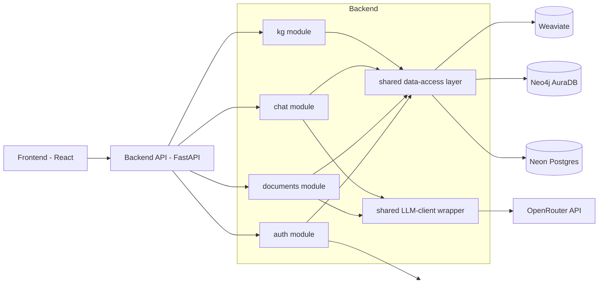
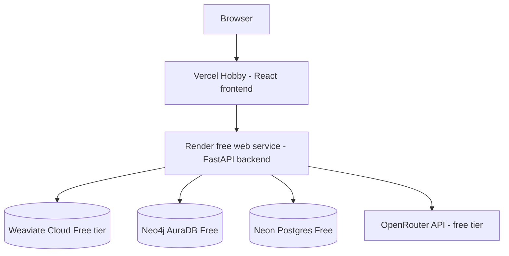

# Architecture Spine — GraphMind

## Design Paradigm

Feature-based (vertical-slice) modular monolith. Each feature module owns its full vertical slice — routing, business logic, and data access — rather than being split across horizontal layers (`routers/`, `services/`, `repositories/`). [ADOPTED]

Four feature modules: `auth`, `documents`, `chat`, `kg`. Chosen specifically because a layered structure would force every feature change to touch several shared directories, producing frequent merge conflicts for 2 developers on a 20-day timeline; vertical modules align code ownership with contributor roles instead.

Hexagonal / ports-and-adapters is explicitly rejected: its payoff (swappable infrastructure behind stable interfaces) doesn't materialize when the stack is fixed by the assignment and the project has a defined end date — the added indirection costs build time without buying usable flexibility. [ADOPTED]

Each module maps to `backend/app/<module>/{routes.py, service.py, repository.py}`. Cross-module infrastructure access (Weaviate, Neo4j, Postgres, OpenRouter) is centralized in `shared/`, never duplicated per-module (see AD-2, AD-6).

## Invariants & Rules

### AD-1 — Ingestion consistency via compensating rollback (saga-lite)

- **Binds:** documents module, FR-4, FR-5
- **Prevents:** orphaned partial state when one of the two ingestion writes (Weaviate, Neo4j) succeeds and the other fails.
- **Rule:** The `documents` table in Postgres tracks ingestion status using the FR-4 vocabulary exactly: `Uploaded → Extracting → Graphing → Ready | Failed`. Write order is fixed: Weaviate write happens first, then Neo4j write. On a Neo4j-write failure, the ingestion handler actively deletes the Weaviate objects just written for that document before marking the document `Failed` with a human-readable reason — rollback direction is unambiguous because write order is fixed. No orphaned partial state survives a failed ingestion. A document's ingestion status row also acts as a simple lock: a retry of a failed ingestion is only permitted when the row is in `Failed` state, never while `Extracting`/`Graphing` is in flight, so a retry can never race an in-progress rollback on the same document. The `documents` module is the sole owner of writes to a document's ingestion-status field — see AD-9's cascade-delete path, which never performs a partial/concurrent status mutation, so there is no ownership conflict between ingestion and account deletion.

### AD-2 — Tenancy enforcement via mandatory shared data-access layer

- **Binds:** all modules, SM-3 (§4.1 launch blocker)
- **Prevents:** a module hand-writing a raw Weaviate or Neo4j query that omits `user_id` filtering, defeating tenancy isolation by convention-drift.
- **Rule:** [ADOPTED] Every read/write to Weaviate or Neo4j goes through shared repository functions (e.g. `get_documents(user_id, ...)`) in `shared/data_access/`. No feature module hand-writes raw queries against these stores directly. This resolves the PRD's one launch-blocker requirement (SM-3, §4.1) structurally, not by convention, across two developers working in parallel.
- **Shape contract (Weaviate):** DAL passage/chunk functions return/accept a flat structure with fields `chunk_id, document_id, user_id, chapter, chunk_index, text, embedding` — no nested `metadata` dict. This is the one shape both the `documents` module (writer) and `chat` module (reader) must agree on.
- **Shape contract (Neo4j):** DAL entity-write functions accept a minimal typed shape — entity `name` + `type`, relationship `type` between two entity references — so the `kg` module's read-side Cypher queries can rely on a consistent node/property contract rather than each module inventing its own.
- **Cypher-injection guardrail (binds FR-2's server-side tenancy note, PRD §4.1 and addendum's Security Note):** any future natural-language-to-Cypher querying (out of v1 scope per PRD §6.2) must have `user_id` injected server-side into the generated query and must never trust LLM-generated output for the tenancy filter. This invariant is on record now, before that feature is built.

### AD-3 — API contract: Pydantic response_model + default HTTPException

- **Binds:** all modules
- **Prevents:** divergent per-module success/error response shapes.
- **Rule:** Every FastAPI route declares a Pydantic `response_model` for its success response. All error paths use FastAPI's default `HTTPException(status_code, detail)` — a single `{"detail": ...}` error shape. No custom error envelope.

### AD-4 — Entity identity resolution: exact match only

- **Binds:** documents module, FR-5
- **Prevents:** false-merge risk from fuzzy or LLM-assisted entity deduplication in v1.
- **Rule:** Entity merge into the unified per-user Knowledge Graph uses exact string match only. `"TechCorp"` and `"TechCorp Supplies"` remain distinct graph nodes. No fuzzy or LLM-assisted merge in v1.

### AD-5 — Frontend state management: React Context API

- **Binds:** frontend
- **Prevents:** introducing Redux boilerplate/tooling disproportionate to the shared-state surface.
- **Rule:** Shared frontend state (auth/user, theme preference, chat document-scope selection) is held in React Context, not Redux or another state library.

### AD-6 — Shared LLM-client wrapper for all OpenRouter calls

- **Binds:** documents module (entity extraction), chat module (answer generation), FR-10
- **Prevents:** duplicated API-key/retry/timeout handling per module, and a bypass of FR-10's refusal short-circuit.
- **Rule:** One module (`shared/llm_client/`) wraps all OpenRouter calls — API key, base URL, model config, retry/timeout handling. No module calls OpenRouter directly. This is also the enforcement point for FR-10: the refusal short-circuit happens before the generation call reaches this wrapper. The `kg` module never calls this wrapper (it only reads Neo4j for visualization).
- **Single refusal source:** there is exactly one source of a "refusal" response. The `chat` module checks the retrieval relevance score *before* ever calling the LLM wrapper; if below threshold, it returns the refusal directly and the LLM wrapper is never invoked for that turn. The LLM wrapper's own internal failures (timeout, retry exhaustion, OpenRouter error) are a distinct, separate failure mode — surfaced as a normal service error per AD-3's `HTTPException` convention (e.g. 503), never dressed up as or conflated with the product's "I don't know" refusal message.

### AD-7 — Deployment topology: Vercel Hobby + Render free web service

- **Binds:** frontend, backend, all modules
- **Prevents:** assuming a paid/always-on hosting baseline that doesn't match the project's zero-cost constraint.
- **Rule:** Frontend deploys to Vercel Hobby (free). Backend deploys to a Render free web service (750 instance-hrs/mo, 15-min idle spin-down, ~1 min cold start on wake). Both verified current as of Aug 2026.

### AD-8 — Single deployed environment, env-var-only secrets

- **Binds:** all modules, deployment
- **Prevents:** environment-tier sprawl and committed secrets.
- **Rule:** Local dev + one deployed prod environment; no staging tier in v1. Secrets are environment variables only, never committed to the repo, managed via each host's native dashboard (Render, Vercel, Neon).

### AD-9 — Account deletion: full cascade hard-delete via the shared data-access layer

- **Binds:** auth module, FR-16
- **Prevents:** an incomplete account deletion that leaves orphaned data in one store.
- **Rule:** On confirmed account deletion, the system hard-deletes the user's Postgres row(s), all of that user's Weaviate objects, and all of that user's Neo4j entities/relationships — using the same shared data-access layer (AD-2) as every other path, not a special-cased raw-query path. Where the deletion itself could partially fail across stores, it follows the same compensating-rollback discipline as ingestion (AD-1) rather than allowing a silent partial delete. The account-deletion path only ever performs a full cascade delete of all of a user's rows at once — it never performs a partial or concurrent mutation of a document's ingestion-status field (that field remains solely owned by the `documents` module per AD-1), so there is no ownership conflict between the two paths.

### Dependency Direction



`kg` never calls the LLM-client wrapper — graph visualization is a pure Cypher read via the shared data-access layer.

## Consistency Conventions

| Concern | Convention |
| --- | --- |
| Naming (entities, files, interfaces, events) | Module directories: `auth/`, `documents/`, `chat/`, `kg/`, each with `routes.py`, `service.py`, `repository.py`. Shared infra in `shared/data_access/` and `shared/llm_client/`. |
| Data & formats (ids, dates, error shapes, envelopes) | Success: Pydantic `response_model` per route (AD-3). Errors: `HTTPException` → `{"detail": ...}` (AD-3). Passage metadata: `user_id`, `document_id`, `chapter`, `chunk_index` (PRD §3). Document status vocabulary: `Uploaded / Extracting / Graphing / Ready / Failed` (AD-1). |
| State & cross-cutting (mutation, errors, logging, config, auth) | JWT in `Authorization` header, resolved to `user_id` server-side (never client-supplied) before any DAL call (AD-2). All Weaviate/Neo4j access goes through `shared/data_access/` (AD-2). All OpenRouter calls go through `shared/llm_client/` (AD-6). |

## Stack

| Name | Version |
| --- | --- |
| Python | 3.12+ |
| FastAPI | 0.141.1 (verified current on PyPI, Aug 2026) |
| Pydantic | v2 |
| React | 19.2.x |
| Vite | 8.2.1 (verified current on npm, Aug 2026) |
| Tailwind CSS | latest (utility-class styling, no visual polish per addendum) |
| weaviate-client (Python) | 4.22.0 (verified current on PyPI, Aug 2026) |
| neo4j (Python driver) | 6.2 |
| react-force-graph | 1.48.2 (verified current on npm, Aug 2026) [ASSUMPTION: resolves an either/or (`react-force-graph` / `vis-network`) left open in the course brief/addendum; confirm in review] |
| Weaviate | Cloud Free tier (free indefinitely as of a June 2026 announcement — no credit card, no time expiration) |
| Neo4j | AuraDB Free tier |
| PostgreSQL | Neon (managed, free tier) |
| SQLAlchemy | 2.0.51 (verified current, Jun 2026) — ORM for the Postgres/Neon layer |
| Alembic | 1.19.0 (verified current, Aug 2026) — schema migrations for the Postgres/Neon layer |
| LLM | OpenRouter (free tier) |
| Auth | JWT + bcrypt |
| Frontend deployment | Vercel Hobby (free) |
| Backend deployment | Render free web service |

## Structural Seed

```text
backend/
  app/
    auth/
      routes.py        # signup, login endpoints
      service.py        # bcrypt hashing, JWT issuance
      repository.py      # user record CRUD (Postgres, via shared DAL)
    documents/
      routes.py        # upload, list, inspect, delete
      service.py        # parse, chunk, dedupe, orchestrate ingestion + rollback (AD-1)
      repository.py      # document status ledger (Postgres, via shared DAL)
    chat/
      routes.py        # ask question, scope selection
      service.py        # embed question, threshold check, refusal short-circuit (FR-10)
      repository.py      # (via shared DAL)
    kg/
      routes.py        # graph visualization endpoint
      service.py        # Cypher query construction, user_id-scoped
      repository.py      # (via shared DAL)
    shared/
      data_access/       # AD-2: sole path to Weaviate / Neo4j / Postgres
      models.py         # SQLAlchemy ORM models (Postgres tables: users, documents)
      llm_client/        # AD-6: sole path to OpenRouter
  alembic/
    versions/           # schema migrations, generated via Alembic against shared/models.py
frontend/
  src/
    pages/            # Chat / Documents / Graph / Settings views
    context/            # React Context: auth/user, theme, chat document-scope (AD-5)
```

### Deployment & Environments



No staging tier — local dev plus this single production topology (AD-8). Render's free instance spins down after 15 min idle, ~1 min cold start on next request.

## Capability → Architecture Map

| Capability / Area | Lives in | Governed by |
| --- | --- | --- |
| Auth & tenancy (FR-1, FR-2) | `auth` module | AD-2, AD-3 |
| Document ingestion (FR-3, FR-4, FR-5, FR-6, FR-14) | `documents` module | AD-1, AD-2, AD-4, AD-6 |
| Document library (FR-7, FR-8) | `documents` module | AD-2, AD-3 |
| Grounded chat Q&A (FR-9, FR-10, FR-11) | `chat` module | AD-2, AD-6 |
| Knowledge graph visualization (FR-12) | `kg` module | AD-2 |
| Evaluation harness (FR-13) | standalone script invoking service layer directly | AD-3 (consumes existing response contracts) |
| Settings — theme, account deletion (FR-15, FR-16) | `auth` module (account), frontend `context/` (theme) | AD-2, AD-5, AD-9 |

## Deferred

- **Weaviate permanent hosting.** Corrected (verified directly, Aug 2026): Weaviate Cloud's free tier is no longer a 14-day expiring sandbox — as of a June 2026 announcement it is free indefinitely, no credit card, no time expiration. This was the spine's biggest flagged risk; it is now resolved, not an urgent must-fix. The only remaining Deferred note is to revisit permanent/paid hosting if usage outgrows the free tier's object-count limits, not before.
- **Exact entity/relationship type list for extraction (FR-5).** Resolved 2026-08-13 (OD-1, `epics.md`): entity types `Person`/`Organization`/`Project`/`Product`/`Location`; relationship types `WORKS_AT`/`SUPPLIES`/`PART_OF`/`LOCATED_IN`/`RELATED_TO` (fallback, so extraction never needs a type outside the closed set).
- **FR-10 relevance threshold value.** The short-circuit *mechanism* is fixed by AD-6; the actual numeric relevance-score cutoff is an empirically-tuned config value that lives in the shared LLM-client wrapper (per AD-6), to be set during implementation/evaluation — not an architectural decision itself.
- **Staging environment.** Not built for v1 (AD-8) — local dev + single prod environment only, revisit if the project continues past the course.
- **Numeric accuracy target for SM-1** and **delete/graph-persistence UX mitigation** (PRD §8, items 2–3) are product/PM-level open questions, not architecture's to resolve, and are not encoded here.
